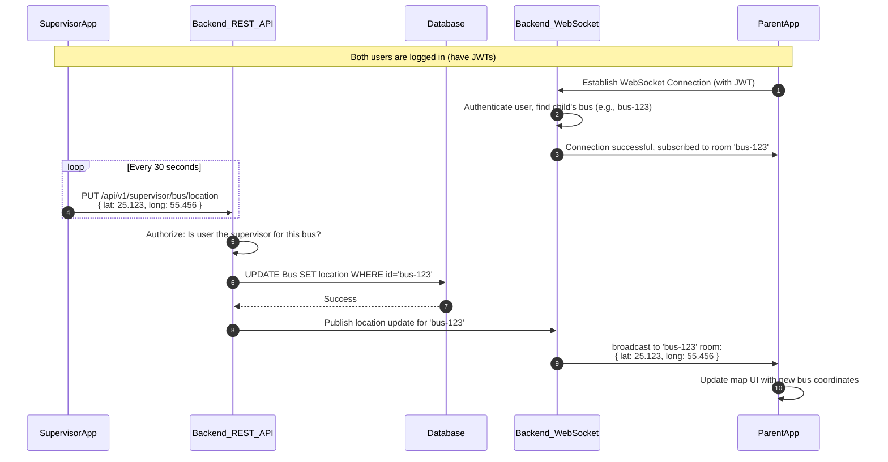

# 3. System Architecture

This document outlines the high-level technical architecture for the Smart Bus Tracking System.

## 3.1. Core Technology Choices

*   **Frontend:** The system will be delivered as a **Progressive Web App (PWA)**. This choice was made strategically to provide a native-like experience (home screen icon, offline capabilities, push notifications) without the overhead and restrictions of the Apple App Store and Google Play Store. It ensures rapid, cross-platform deployment.
*   **Backend:** The backend is a modern Node.js application built with the Express.js framework. It provides a RESTful API for standard data operations.
*   **Database:** The system uses PostgreSQL, managed via the Prisma ORM. This provides a strongly-typed, secure, and scalable data layer.
*   **Real-time Communication:** Real-time features, primarily the live map tracking, are powered by **WebSockets**.

## 3.2. Architectural Overview

The system operates on a classic client-server model but is enhanced with a real-time communication layer for a dynamic user experience.

*   **Admin Interface:** A web-based dashboard used on desktop computers to manage the entire system.
*   **Supervisor Interface:** A PWA used on a mobile phone to manage attendance and broadcast GPS location.
*   **Parent Interface:** A PWA used on a mobile phone to track the bus, view student status, and receive notifications.

## 3.3. Real-Time Tracking Data Flow

The most complex architectural component is the real-time data flow that enables parents to track the bus live on a map. This involves two distinct user actions funneled through the backend.

1.  **The Supervisor Broadcasts Location:** The supervisor's PWA periodically sends its GPS coordinates to a standard REST API endpoint.
2.  **The Parent Subscribes to Updates:** The parent's PWA establishes a persistent WebSocket connection to the backend.
3.  **The Backend Connects the Two:** The backend receives the supervisor's location update via the REST API, immediately saves it to the database, and then broadcasts that new location to all parents subscribed to that specific bus's WebSocket "room".

### Workflow Diagram

The following diagram illustrates this entire process from end to end:

