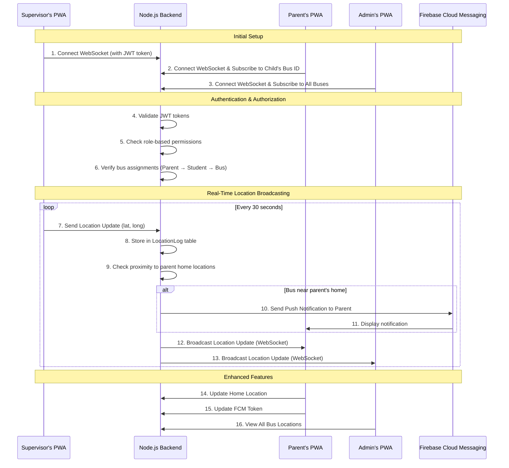

# Real-Time Tracking Architecture

This diagram illustrates the high-level data flow for the real-time bus tracking feature. It shows how the Supervisor's PWA communicates with the backend, which then broadcasts the location data to authorized users (Parents and Admin) in real-time using WebSockets.

## Architecture Components

### 🔐 **Authentication & Authorization**
- **JWT Tokens**: Secure WebSocket connections
- **Role-Based Access**: Different subscription permissions
  - **Admin**: Can subscribe to all buses
  - **Parent**: Can subscribe to their child's bus only
  - **Supervisor**: Can subscribe to their assigned bus

### 📍 **Location Management**
- **Real-Time Updates**: 30-second intervals
- **Location Storage**: Persistent in LocationLog table
- **Proximity Detection**: Check distance to parent home locations

### 📱 **Push Notifications**
- **Firebase Cloud Messaging**: Real-time notifications
- **Proximity-Based**: Notify parents when bus is near home
- **FCM Token Management**: Dynamic token updates

### 🏠 **Home Location System**
- **Parent Home Location**: Stored in Parent table
- **Supervisor Home Location**: Stored in Supervisor table
- **Proximity Calculations**: Real-time distance checking

### 📊 **Data Flow**
1. **Supervisor**: Broadcasts location from PWA
2. **Backend**: Validates, stores, and processes location
3. **Proximity Check**: Calculates distance to parent homes
4. **Push Notifications**: Sends FCM notifications if near
5. **WebSocket Broadcast**: Sends to all authorized subscribers

## Security Features

### 🔒 **WebSocket Security**
- **JWT Authentication**: Token-based WebSocket connections
- **Role Verification**: Server-side permission checking
- **Bus Assignment Validation**: Ensures parents only see their child's bus

### 🛡️ **Data Protection**
- **Encrypted Communication**: HTTPS/WSS protocols
- **Token Blacklisting**: Secure logout mechanism
- **Input Validation**: All location data validated

## Performance Optimizations

### ⚡ **Real-Time Performance**
- **WebSocket Connections**: Persistent connections for low latency
- **Efficient Broadcasting**: Only send to authorized users
- **Location Caching**: Optimized database queries

### 📈 **Scalability**
- **Horizontal Scaling**: Multiple WebSocket servers
- **Database Indexing**: Optimized for location queries
- **Load Balancing**: Distribute WebSocket connections 