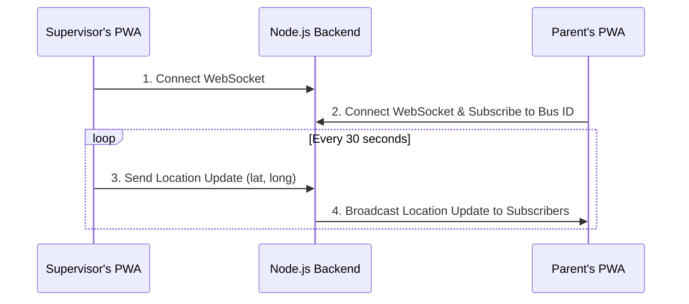

# Real-Time Tracking Architecture

This diagram illustrates the high-level data flow for the real-time bus tracking feature. It shows how the Supervisor's PWA communicates with the backend, which then broadcasts the location data to the Parent's PWA in real-time using WebSockets.

