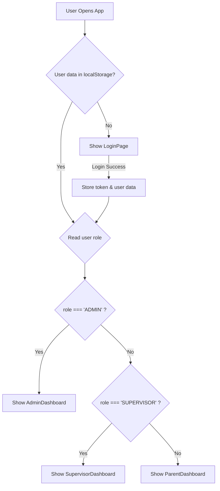

# Frontend Role-Based Routing

This diagram shows the logic flow in the main `App.jsx` component. It details how the application checks for a logged-in user and their role in `localStorage` to correctly route them to the appropriate dashboard (Admin, Supervisor, or Parent).

