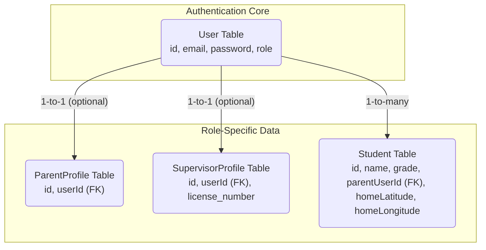

# Polymorphic User Database Architecture

This diagram illustrates our database schema for handling different user roles. It shows how a central `User` table handles authentication, while separate `Parent` and `Supervisor` profile tables store role-specific data, linked by a foreign key.

