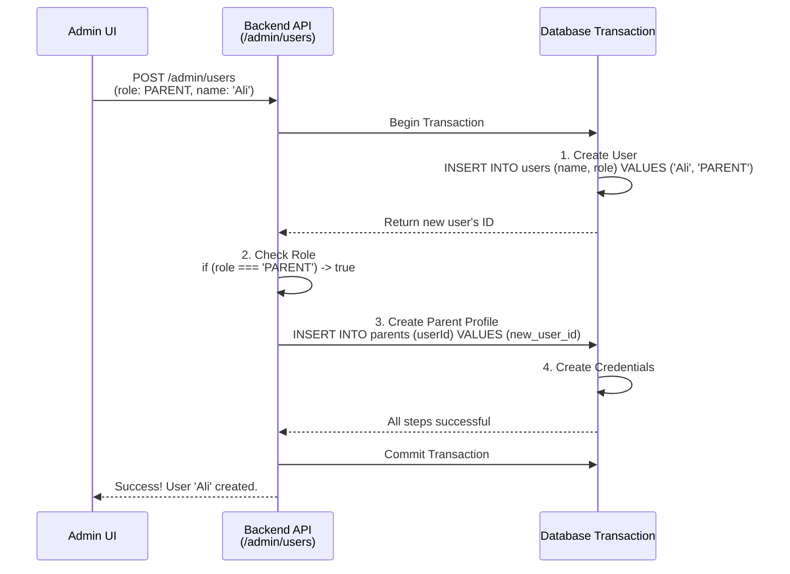

# Create User Transaction Flow

This sequence diagram details the backend process when an admin creates a new `PARENT` user. It shows the database transaction that ensures both the core `User` and the `Parent` profile are created together in a single, atomic operation.

