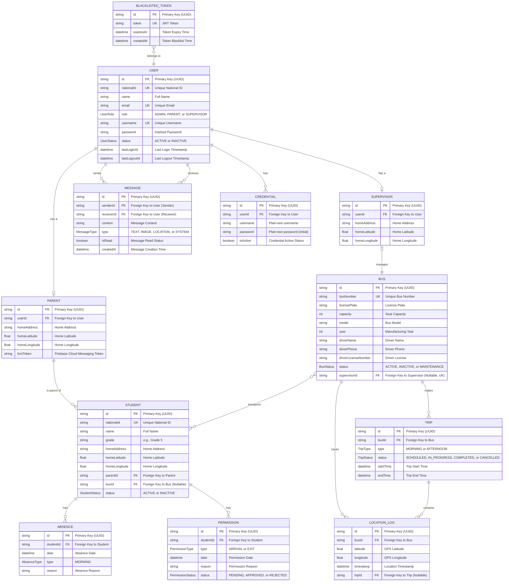

# Database Entity-Relationship Diagram (ERD)

This diagram provides a comprehensive overview of the entire database schema. It illustrates every table, its key columns, and the relationships (one-to-one, one-to-many) between them.

## Key Features Represented

### 🏠 **Home Location System**
- **Parent** and **Supervisor** models include `homeAddress`, `homeLatitude`, `homeLongitude`
- Enables proximity-based notifications and route optimization

### 📱 **Push Notifications**
- **Parent** model includes `fcmToken` for Firebase Cloud Messaging
- Enables real-time notifications for bus arrival/departure

### 📊 **Trip History**
- **Trip** model tracks complete bus journeys (morning pickup, afternoon return)
- **LocationLog** links to trips for historical analysis
- Supports trip status tracking (scheduled, in-progress, completed, cancelled)

### 💬 **Communication System**
- **Message** model enables in-app messaging between users
- Supports different message types (text, image, location, system)
- Tracks read status and message history

### 📋 **Student Management**
- **Absence** tracking for attendance management
- **Permission** system for parent pickup/drop-off requests
- Comprehensive student lifecycle management

### 🚌 **Real-Time Tracking**
- **LocationLog** stores real-time bus location data
- **Bus** model includes comprehensive vehicle information
- **Supervisor** assignment for bus management

## Database Design Principles

### 🔐 **Security**
- **User** table centralizes authentication
- **BlackListedToken** ensures secure logout
- **Credential** stores initial passwords (temporary)

### 📈 **Scalability**
- UUID primary keys for distributed systems
- Proper indexing on frequently queried fields
- Normalized design with clear relationships

### 🔄 **Data Integrity**
- Foreign key constraints maintain referential integrity
- Enum types ensure data consistency
- Timestamps for audit trails

### 🎯 **Business Logic**
- **Polymorphic User System**: Single User table with role-specific profiles
- **Role-Based Access**: Clear separation between Admin, Supervisor, and Parent
- **Real-Time Capabilities**: WebSocket-ready data structure 