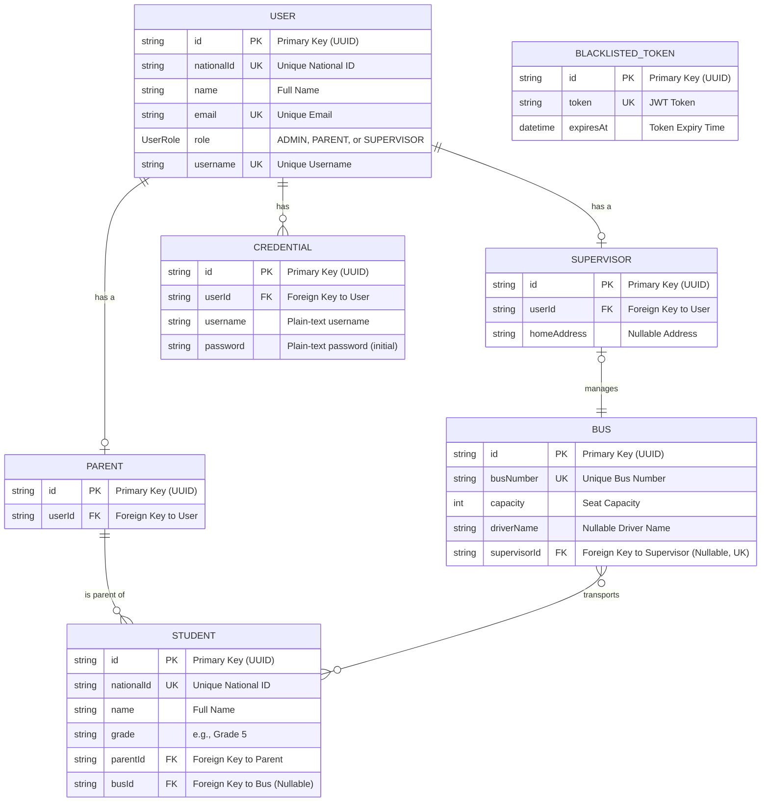

# Database Entity-Relationship Diagram (ERD)

This diagram provides a comprehensive overview of the entire database schema. It illustrates every table, its key columns, and the relationships (one-to-one, one-to-many) between them.

